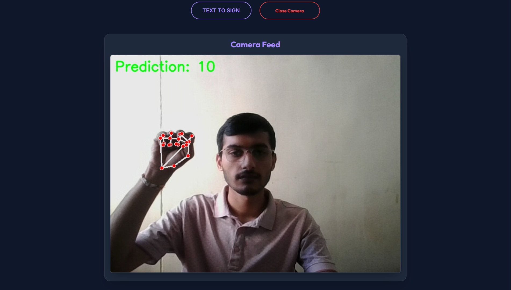
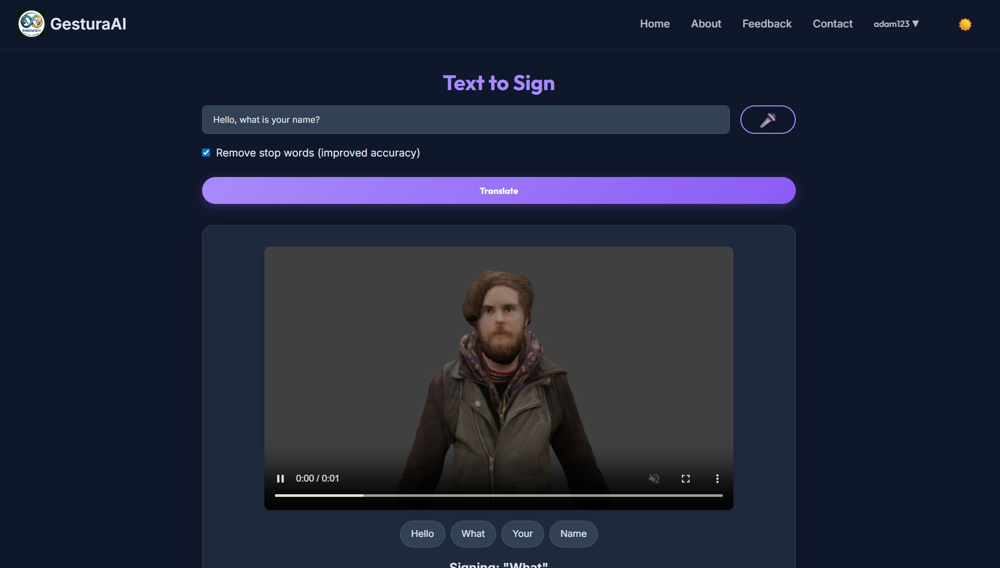
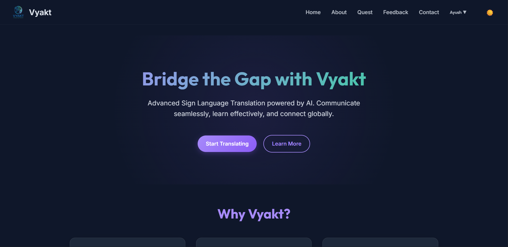
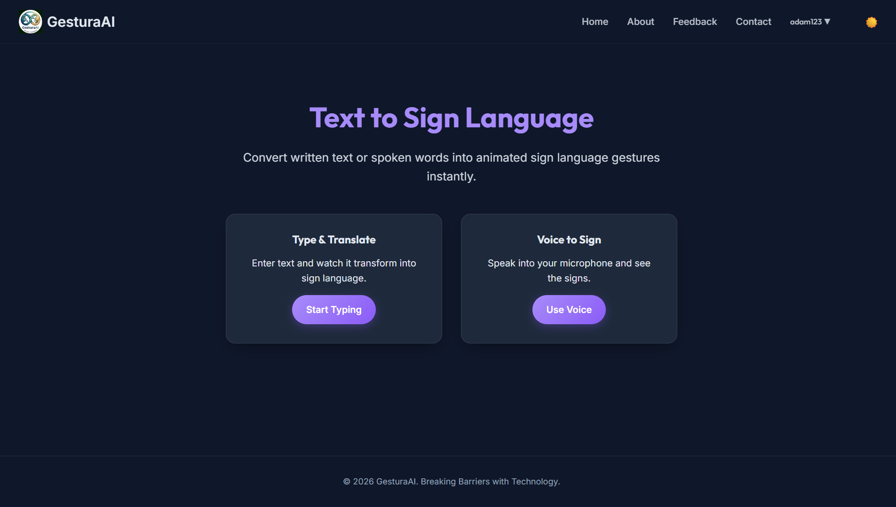

# Vyakt


**Vyakt** is a two-way sign language translator that breaks communication barriers using technology. It translates sign language gestures to text in real-time and converts text input into sign language animations.


## Features

### Sign-to-Text
Real-time gesture recognition using computer vision and deep learning.


### Text-to-Sign
Converts text input into sign language animations.


### Dashboard
User-friendly dashboard to manage your profile and settings.


### Animation Dashboard
Dedicated interface for text-to-sign translation.



## End-to-End Pipeline

### 1. Install dependencies
```bash
pip install -r requirements.txt
```

### 2. Set environment variables
Create a `.env` file in `Vyakt/` with the following variables:

```env
FLASK_SECRET_KEY=change_me
MYSQL_HOST=localhost
MYSQL_USER=root
MYSQL_PASSWORD=
MYSQL_DB=sign_language_app
MYSQL_PORT=3306
GOOGLE_TRANSLATE_API_KEY=your_google_translate_api_key
Vyakt_MODEL_PATH=Model/artifacts/gesture_transformer_126.pth
```

### 3. Run Flask app
```bash
cd Vyakt
python app.py
```
Access the application at `http://127.0.0.1:5000`.

## Model Training (Optional)

### 1. Collect dataset samples
```bash
python Model/collect_imgs.py
```

### 2. Build dataset
```bash
python Model/create_dataset.py --data-dir data --output Model/artifacts/data_seq.pickle --sequence-length 30
```

### 3. Train model
```bash
python Model/train.py --data Model/artifacts/data_seq.pickle --output Model/artifacts/gesture_transformer_126.pth --epochs 30 --batch-size 32
```

### 4. Run standalone inference
```bash
python Model/inference_classifier.py --checkpoint Model/artifacts/gesture_transformer_126.pth
```
